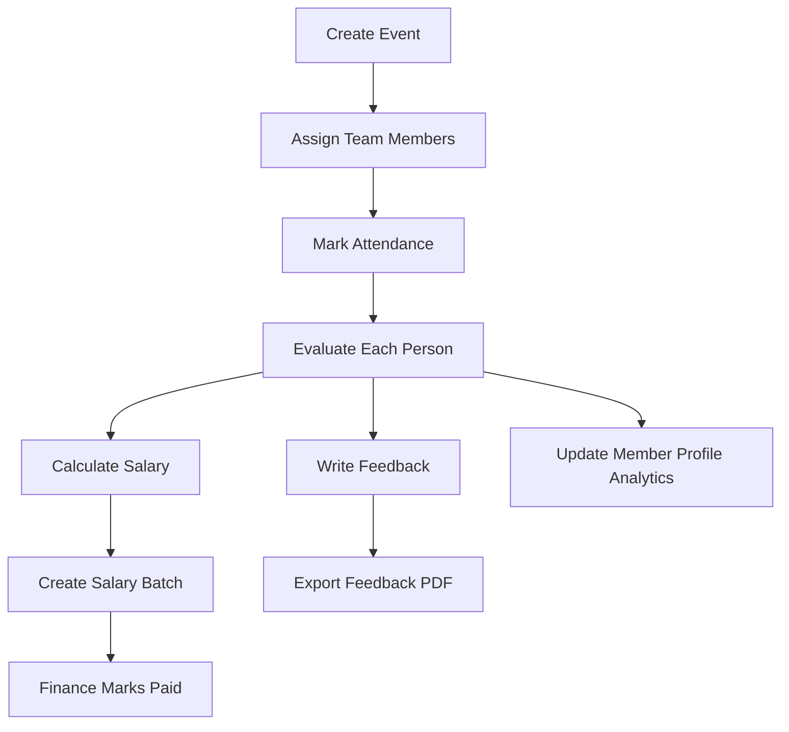

# GMind Events Team Admin System

## 1. System Purpose

GMind needs a web-based admin system for managing the Events Team internally. The system will replace the current scattered workflow across multiple Excel sheets and feedback PDFs.

The system should allow the Event Manager, Events Team HR, CEO, and Financial Manager to manage:

- Team database
- Event records
- Attendance
- Event-by-event evaluations
- Feedback
- Salaries and payment batches
- Training
- Warnings and notes
- Dashboards and analysis
- PDF and Excel exports

The first version will be a manual admin system. No team member self-service portal is required now.

## 2. Confirmed Decisions

| Area | Decision |
|---|---|
| Main users | Event Manager, Events Team HR, CEO, Financial Manager |
| Access level | Same access level for all users for now |
| Platform | Web app to be built using Antigravity |
| Attendance | Manual entry |
| Evaluation | Manual after each event |
| Salary logic | Event rate x performance percentage |
| Deductions | Manual only |
| Coordinator salary | Different rate/formula from facilitators and animators |
| Feedback export | Normal PDF export, not Canva-style design |
| GMind IDs | Existing IDs are used; do not auto-generate or change IDs |
| Event rates | Editable by admin from Settings |

## 3. Current Problems To Solve

The current workflow has useful data, but it is split across files:

- `Team Database.xlsx` includes team identity, contacts, scores, event counts, money, social links, and photos.
- `Events HR (2).xlsx` includes monthly payroll, attendance/event history, warnings, coordinator payments, and external team decisions.
- `_Feedbacks.pdf` includes qualitative feedback, strengths, gaps, and recommendations.

Main problems:

- Event names are stored inside one cell instead of one event record per row.
- Evaluation score exists, but the criteria behind the score are not structured.
- Feedback exists as PDF text, but it is not connected to team profiles.
- Salary logic changed over time, so rates must be configurable.
- Coordinator payments use different logic than normal event team payments.
- Training attendance is stacked inside the same sheet structure and needs normalization.
- Selection, promotion readiness, warning history, and role readiness are not connected.

## 4. Main System Modules

The web app should include these modules:

1. Dashboard
2. Team Database
3. Events Database
4. Event Assignment
5. Attendance
6. Evaluations
7. Feedback
8. Salaries and Payment Batches
9. Training Tracker
10. Warnings and Notes
11. Reports and Exports
12. Settings

## 5. User Roles

For version 1, all users have the same access level.

Users:

- Event Manager
- Events Team HR
- CEO
- Financial Manager

Even though access is the same now, the database should store a `role` field so permissions can be added later.

Future optional permission levels:

| Role | Future Permission |
|---|---|
| Event Manager | Full event/team/evaluation control |
| Events HR | Team records, feedback, warnings, training |
| CEO | View all, approve feedback or salaries |
| Financial Manager | View salary batches and mark payments as sent |

## 6. Core Data Model

Important rule:

Do not store multiple events inside one cell.

Correct structure:

- One team member = one row in `team_members`
- One event = one row in `events`
- One event participation = one row in `event_assignments`
- One attendance record = one row in `attendance`
- One evaluation = one row in `evaluations`
- One salary item = one row in `salary_records`

## 7. Database Tables

### 7.1 users

Stores admin users.

| Field | Type | Notes |
|---|---|---|
| id | UUID | Primary key |
| name | Text | User name |
| email | Text | Login email |
| password_hash | Text | For authentication |
| role | Enum | event_manager, events_hr, ceo, financial_manager |
| status | Enum | active, inactive |
| created_at | DateTime | Auto |
| updated_at | DateTime | Auto |

### 7.2 team_members

Main team profile table.

| Field | Type | Notes |
|---|---|---|
| id | UUID | Primary key |
| gmind_id | Text | Existing GMind ID, do not auto-generate |
| full_name | Text | Required |
| phone | Text | Required when available |
| email | Text | Required when available |
| date_of_birth | Date | Optional |
| age | Number | Auto-calculated from date of birth if available |
| school_or_faculty | Enum | school, faculty, other, unknown |
| school_or_faculty_name | Text | Optional |
| nationality | Text | Optional |
| governorate | Text | Optional |
| address | Text | Optional |
| social_media_link | Text | Optional |
| personal_photo_url | Text | Optional |
| team_type | Enum | internal, newcomer, external, coordinator |
| main_role | Enum | facilitator, animator, coordinator, event_manager_candidate, trainee |
| status | Enum | active, inactive, trainee, rejected, on_hold |
| ar_support | Boolean | Can support AR |
| vr_support | Boolean | Can support VR |
| languages | Text/Array | Example: AR, EN, FR |
| start_date | Date | Optional |
| notes | Long text | Internal notes |
| created_at | DateTime | Auto |
| updated_at | DateTime | Auto |

### 7.3 events

Stores all GMind events.

| Field | Type | Notes |
|---|---|---|
| id | UUID | Primary key |
| event_name | Text | Required |
| client_name | Text | School, nursery, partner, public event |
| event_type | Enum | nursery, school, public_event, competition, training, online, custom |
| event_date | Date | Required |
| location | Text | Optional |
| expected_kids | Number | Optional |
| actual_kids | Number | Optional |
| required_team_count | Number | Optional |
| event_manager_id | FK | User or team member |
| status | Enum | planned, confirmed, completed, canceled |
| notes | Long text | Internal notes |
| created_at | DateTime | Auto |
| updated_at | DateTime | Auto |

### 7.4 event_assignments

Stores who is assigned to each event.

| Field | Type | Notes |
|---|---|---|
| id | UUID | Primary key |
| event_id | FK | References events |
| team_member_id | FK | References team_members |
| assigned_role | Enum | facilitator, animator, coordinator, vr_support, ar_support, setup, media_support, trainee |
| planned_rate | Number | Pulled from settings but editable |
| assignment_status | Enum | assigned, confirmed, replaced, canceled |
| notes | Long text | Optional |
| created_at | DateTime | Auto |
| updated_at | DateTime | Auto |

### 7.5 attendance

Manual attendance record per event/person.

| Field | Type | Notes |
|---|---|---|
| id | UUID | Primary key |
| event_id | FK | References events |
| team_member_id | FK | References team_members |
| attendance_status | Enum | attended, absent, late, left_early, excused |
| arrival_time | Time | Optional |
| leaving_time | Time | Optional |
| attendance_note | Long text | Optional |
| marked_by_user_id | FK | Admin who marked attendance |
| created_at | DateTime | Auto |
| updated_at | DateTime | Auto |

### 7.6 evaluations

Manual evaluation after each event.

| Field | Type | Notes |
|---|---|---|
| id | UUID | Primary key |
| event_id | FK | References events |
| team_member_id | FK | References team_members |
| evaluator_user_id | FK | Event Manager / Events HR |
| punctuality_commitment | Number | Max 3 |
| task_focus_responsibility | Number | Max 3 |
| kids_handling | Number | Max 4 |
| energy_engagement | Number | Max 3 |
| explanation_animator_skill | Number | Max 3 |
| vr_ar_game_handling | Number | Max 3 |
| teamwork | Number | Max 2 |
| problem_solving_pressure | Number | Max 2 |
| professionalism | Number | Max 1 |
| leadership_potential | Number | Max 1 |
| total_score | Number | Auto sum, max 25 |
| performance_percentage | Number | Auto: total_score / score_max x 100 |
| general_notes | Long text | Optional |
| created_at | DateTime | Auto |
| updated_at | DateTime | Auto |

Default evaluation score:

| Criteria | Max Score |
|---|---:|
| Punctuality and commitment | 3 |
| Task focus and responsibility | 3 |
| Kids handling | 4 |
| Energy and engagement | 3 |
| Explanation / animator skill | 3 |
| VR/AR/game handling | 3 |
| Teamwork | 2 |
| Problem solving under pressure | 2 |
| Professionalism | 1 |
| Leadership potential | 1 |
| Total | 25 |

Formula:

```text
Performance Percentage = Total Score / Score Max x 100
```

### 7.7 feedbacks

Stores qualitative feedback.

| Field | Type | Notes |
|---|---|---|
| id | UUID | Primary key |
| team_member_id | FK | References team_members |
| event_id | FK | Optional, if feedback is event-specific |
| period_label | Text | Example: Summer, Fall and Winter Season |
| feedback_type | Enum | event_feedback, period_feedback, warning_feedback, promotion_feedback |
| strengths | Long text | Required |
| gaps | Long text | Optional |
| recommendations | Long text | Required |
| training_needed | Boolean | Optional |
| promotion_ready | Boolean | Optional |
| recommended_role | Enum | facilitator, animator, coordinator, event_manager_candidate, remain_current, on_hold |
| prepared_by_user_id | FK | Event Manager / HR |
| approved_by_user_id | FK | CEO, optional for now |
| export_pdf_url | Text | Optional generated PDF link |
| created_at | DateTime | Auto |
| updated_at | DateTime | Auto |

Feedback should support two views:

- Internal detailed feedback
- Simple shareable PDF feedback

The PDF does not need to match Canva design. It should be a clean normal PDF.

### 7.8 warnings_notes

Tracks warnings, notes, and improvement plans.

| Field | Type | Notes |
|---|---|---|
| id | UUID | Primary key |
| team_member_id | FK | References team_members |
| event_id | FK | Optional |
| note_type | Enum | feedback, warning, serious_warning, no_show, behavior_issue, attendance_issue, performance_issue, improvement_plan |
| title | Text | Required |
| description | Long text | Required |
| action_required | Long text | Optional |
| due_date | Date | Optional |
| status | Enum | open, resolved, ignored |
| created_by_user_id | FK | Admin user |
| created_at | DateTime | Auto |
| updated_at | DateTime | Auto |

### 7.9 rate_settings

Admin-editable rates and scoring settings.

| Field | Type | Notes |
|---|---|---|
| id | UUID | Primary key |
| event_type | Enum | nursery, school, public_event, competition, training, online, custom |
| role | Enum | facilitator, animator, coordinator, vr_support, ar_support, trainee |
| base_rate | Number | EGP |
| salary_formula_type | Enum | rate_x_percentage, fixed_rate, manual |
| score_max | Number | Default 25 |
| active_from | Date | Optional |
| active_to | Date | Optional |
| is_active | Boolean | Only active rates should be used |
| created_at | DateTime | Auto |
| updated_at | DateTime | Auto |

Example settings:

| Event Type | Role | Base Rate | Formula |
|---|---|---:|---|
| nursery | facilitator | editable | rate_x_percentage |
| school | facilitator | editable | rate_x_percentage |
| nursery | animator | editable | rate_x_percentage |
| school | animator | editable | rate_x_percentage |
| nursery | coordinator | editable | fixed_rate or manual |
| school | coordinator | editable | fixed_rate or manual |
| public_event | any | editable/manual | manual |
| competition | any | editable/manual | manual |
| training | trainee | 0 or manual | manual |

### 7.10 salary_records

One salary item per person per event.

| Field | Type | Notes |
|---|---|---|
| id | UUID | Primary key |
| event_id | FK | References events |
| team_member_id | FK | References team_members |
| role | Enum | Role in this event |
| event_type | Enum | Copied from event |
| base_rate | Number | Pulled from settings but editable |
| performance_percentage | Number | From evaluation |
| calculated_salary | Number | Auto |
| bonus | Number | Manual |
| deduction | Number | Manual |
| final_salary | Number | Auto |
| payment_status | Enum | pending, sent, canceled |
| payment_method | Enum | cash, instapay, bank_transfer, wallet, other |
| financial_note | Long text | Optional |
| payment_batch_id | FK | Optional |
| created_at | DateTime | Auto |
| updated_at | DateTime | Auto |

Normal team formula:

```text
Calculated Salary = Base Rate x Performance Percentage
Final Salary = Calculated Salary + Bonus - Deduction
```

Where:

```text
Performance Percentage = performance_percentage / 100
```

Example:

```text
Base Rate = 150 EGP
Performance Percentage = 88%
Calculated Salary = 150 x 0.88 = 132 EGP
```

Coordinator formula should be configurable:

Option A:

```text
Coordinator Salary = Coordinator Rate + Bonus - Deduction
```

Option B:

```text
Coordinator Salary = Coordinator Rate x Performance Percentage + Bonus - Deduction
```

Option C:

```text
Coordinator Salary = Manual Amount + Bonus - Deduction
```

### 7.11 payment_batches

Monthly or custom salary batches for finance.

| Field | Type | Notes |
|---|---|---|
| id | UUID | Primary key |
| batch_name | Text | Example: Jan 2026 Salaries |
| period_start | Date | Required |
| period_end | Date | Required |
| total_amount | Number | Auto sum |
| status | Enum | draft, ready_for_payment, partially_paid, paid, canceled |
| prepared_by_user_id | FK | Admin user |
| approved_by_user_id | FK | Optional |
| sent_by_user_id | FK | Financial manager |
| sent_at | DateTime | Optional |
| notes | Long text | Optional |
| created_at | DateTime | Auto |
| updated_at | DateTime | Auto |

### 7.12 training_sessions

Training events.

| Field | Type | Notes |
|---|---|---|
| id | UUID | Primary key |
| session_name | Text | Required |
| session_date | Date | Required |
| trainer_name | Text | Optional |
| topic | Text | Optional |
| session_type | Enum | online, offline, mixed |
| notes | Long text | Optional |
| created_at | DateTime | Auto |
| updated_at | DateTime | Auto |

### 7.13 training_attendance

One row per person per training session.

| Field | Type | Notes |
|---|---|---|
| id | UUID | Primary key |
| training_session_id | FK | References training_sessions |
| team_member_id | FK | References team_members |
| attendance_status | Enum | attended, absent, late, excused |
| activity_score | Number | Optional, can be -1, 0, 1, 2 or custom |
| passed | Boolean | Optional |
| notes | Long text | Optional |
| created_at | DateTime | Auto |
| updated_at | DateTime | Auto |

## 8. Main Workflows

### 8.1 Event Workflow



### 8.2 Salary Workflow

1. Event is completed.
2. Attendance is marked.
3. Evaluation is completed for every attended team member.
4. System pulls event type, role, rate, and performance percentage.
5. System calculates salary.
6. Admin can add manual bonus or deduction.
7. Final salary is saved.
8. Salary records can be added to a payment batch.
9. Financial Manager marks payment as sent.

### 8.3 Feedback Workflow

1. Event Manager opens team member profile or event evaluation.
2. Event Manager writes strengths, gaps, and recommendations.
3. Admin can mark training needed, promotion ready, or warning needed.
4. Feedback appears in team member profile history.
5. Admin can export simple PDF.

### 8.4 Training Workflow

1. Admin creates training session.
2. Admin adds team members.
3. Admin marks attendance and activity score.
4. Admin adds notes.
5. Training results update member readiness.

## 9. UI Screens

### 9.1 Login Screen

Fields:

- Email
- Password
- Login button

### 9.2 Dashboard

Dashboard cards:

| Card | Description |
|---|---|
| Active team members | Current usable team pool |
| Newcomers | People in training/testing |
| External team | Temporary or external GMind access |
| Coordinators | Coordinator pool |
| Events this month | Count of monthly events |
| Pending attendance | Events completed but attendance missing |
| Pending evaluations | Attendance done but evaluation missing |
| Pending salaries | Salary records not sent |
| Monthly salary total | Current month cost |
| Top performers | Highest average score |
| Most active members | Highest event count |
| Attendance risk | Repeated absence/lateness |
| Ready for animator | Strong performance and kids handling |
| Ready for coordinator | Leadership and reliability |
| Repeated warnings | Risk control |

Charts:

- Events by type
- Salary total by month
- Average performance by month
- Team members by status
- Top 10 event participants
- Warning count by type

### 9.3 Team Database Screen

Features:

- Search by name, ID, phone, email
- Filter by status
- Filter by team type
- Filter by main role
- Filter by AR/VR support
- Filter by language
- Filter by promotion readiness
- Import from Excel
- Export to Excel

Team table columns:

- Name
- GMind ID
- Phone
- Status
- Team type
- Main role
- AR
- VR
- Languages
- Average performance
- Total events
- Warnings
- Last event

### 9.4 Team Member Profile

Tabs:

1. Overview
2. Event History
3. Evaluations
4. Feedback
5. Salaries
6. Training
7. Warnings and Notes

Overview should show:

- Personal details
- Current status
- Main role
- AR/VR/language abilities
- Total events
- Average score
- Average percentage
- Total salaries
- Warnings count
- Promotion readiness
- Internal notes

### 9.5 Events Screen

Features:

- Create event
- Edit event
- Filter by date, type, status, client
- Open event details
- Assign team
- Mark attendance
- Evaluate team
- Generate salaries

Event table columns:

- Event name
- Date
- Client
- Event type
- Status
- Assigned team count
- Attendance status
- Evaluation status
- Salary status

### 9.6 Event Details Screen

Tabs:

1. Event Info
2. Assigned Team
3. Attendance
4. Evaluations
5. Salaries
6. Event Notes

### 9.7 Attendance Screen

For each assigned team member:

- Attendance status
- Arrival time
- Leaving time
- Attendance note

Bulk actions:

- Mark all as attended
- Mark selected as absent
- Save attendance

### 9.8 Evaluation Screen

For each attended team member:

- Fill 10 criteria
- Auto-calculate total score
- Auto-calculate performance percentage
- Add notes
- Save evaluation

Validation:

- Score cannot exceed max per criteria.
- Total cannot exceed 25 unless score settings are changed.
- Salary cannot be generated unless evaluation exists, except when salary formula is manual.

### 9.9 Feedback Screen

Fields:

- Team member
- Event or period
- Feedback type
- Strengths
- Gaps
- Recommendations
- Training needed
- Promotion ready
- Recommended role
- Internal note

Actions:

- Save feedback
- Export PDF
- Add warning from feedback

### 9.10 Salaries Screen

Views:

- All salary records
- Pending payments
- Paid payments
- Payment batches

Filters:

- Date range
- Event
- Team member
- Payment status
- Payment method
- Role

Actions:

- Generate salaries from completed event
- Add bonus
- Add deduction
- Edit base rate manually
- Add to payment batch
- Mark as sent
- Export salary sheet

### 9.11 Payment Batch Screen

Fields:

- Batch name
- Period start
- Period end
- Included salary records
- Total amount
- Status
- Finance notes

Actions:

- Create batch
- Add/remove salary records
- Export Excel
- Mark paid

### 9.12 Training Screen

Features:

- Create training session
- Add attendees
- Mark attendance
- Add activity score
- Mark passed/needs retraining
- Add notes

### 9.13 Warnings and Notes Screen

Features:

- Add warning or note
- Link to event if relevant
- Set action required
- Set due date
- Mark resolved

Note types:

- Feedback
- Warning
- Serious warning
- No-show
- Behavior issue
- Attendance issue
- Performance issue
- Improvement plan

### 9.14 Settings Screen

Admin can edit:

- Event type rates
- Role rates
- Coordinator salary formula
- Score max
- Evaluation criteria labels and max points
- Payment methods
- Team roles
- Team statuses
- Export settings

## 10. Analytics Logic

### 10.1 Average Performance

```text
Average Performance = Average of all performance percentages
```

### 10.2 Total Events

```text
Total Events = Count of attended event attendance records
```

### 10.3 Attendance Risk

Flag member as attendance risk if:

- 2 or more absences in recent period
- 2 or more late records in recent period
- Feedback includes attendance issue
- Warning note type is attendance_issue

### 10.4 Ready For Animator

Suggested rule:

- Average performance >= 85%
- Kids handling average >= 3/4
- Explanation/animator skill average >= 2.5/3
- Attendance risk = false
- At least 3 completed events

Admin can override manually.

### 10.5 Ready For Coordinator

Suggested rule:

- Average performance >= 88%
- Leadership potential average >= 0.8/1
- Problem solving average >= 1.5/2
- Teamwork average >= 1.5/2
- Attendance risk = false
- At least 5 completed events

Admin can override manually.

### 10.6 Salary Total

```text
Monthly Salary Total = Sum of final_salary for selected month
```

### 10.7 Cost Per Event

```text
Cost Per Event = Sum of final_salary for all team members assigned to the event
```

## 11. Import Requirements

The system should support importing from current Excel sheets.

### 11.1 Team Database Import

From `Team Database.xlsx`, import:

- Name
- ID
- Phone
- Email
- Date of birth
- Mobile support
- School/faculty
- Nationality
- Governorate
- Address
- Avg score
- Percentage
- Event counts
- Money
- Social media link
- Personal photos

Important:

- Do not overwrite existing GMind IDs.
- If a name exists but ID is missing, flag for manual review.
- If duplicates exist, flag before import.

### 11.2 HR Sheet Import

From `Events HR (2).xlsx`, import:

- Monthly event history
- Salary records
- Warnings/feedback notices
- External team decisions
- Coordinator payments

Important:

- Treat monthly sheets as historical data.
- Do not force them into current rate formula.
- Store historical salary exactly as imported when needed.

### 11.3 Feedback PDF Import

From `_Feedbacks.pdf`, import manually or semi-automatically:

- Team member name
- Period
- Strengths
- Recommendations
- Prepared by
- Approved by

Important:

- Match names carefully.
- Flag unmatched names.
- Flag duplicate feedback records.

## 12. Export Requirements

The system should export:

- Team database Excel
- Event attendance Excel
- Event evaluations Excel
- Salary payment batch Excel
- Individual feedback PDF
- Period feedback PDF
- Team performance report PDF

## 13. Feedback PDF Format

Simple PDF layout:

- GMind logo
- Title: Personal Feedback
- Name
- Period or event
- Strengths
- Recommendations
- Prepared by
- Approved by

No need to match Canva design.

## 14. Validation Rules

- Team member name is required.
- GMind ID should be unique when provided.
- Event date is required.
- Attendance cannot be marked before team assignment.
- Evaluation cannot be completed for absent members unless admin allows manual override.
- Salary should not be generated before evaluation unless salary formula is manual.
- Final salary cannot be negative.
- Payment batch cannot be marked paid unless it has salary records.
- Base rates should be stored historically with each salary record.

## 15. Recommended MVP Build Order

### Phase 1: Core Database

- Login
- Team database
- Event database
- Event assignment
- Manual attendance

### Phase 2: Evaluation and Salary

- Event evaluation form
- Salary calculation
- Manual bonus/deduction
- Payment status
- Payment batch export

### Phase 3: Feedback and HR Control

- Feedback records
- Simple PDF export
- Warnings and notes
- Training tracker

### Phase 4: Dashboard and Analysis

- Performance dashboard
- Salary dashboard
- Attendance risk
- Promotion readiness
- Export center

### Phase 5: Import Tools

- Import team database
- Import HR sheets
- Import historical feedback

## 16. Design Direction

Use GMind branding:

- Primary color: deep purple similar to `#3B3777`
- Accent color: bright green used in GMind feedback files
- Clean admin dashboard style
- Dense but readable tables
- Rounded cards with small radius
- Clear filters and status badges
- Avoid decorative heavy visuals

The system is operational, so the design should be:

- Fast to scan
- Table-first
- Dashboard-driven
- Simple for Event Manager and HR to use during busy operations

## 17. Antigravity Build Prompt

Build a web admin system called "GMind Events Team Admin System".

The system manages GMind's internal events team, including team database, events, attendance, evaluations, feedback, salaries, training, warnings, dashboards, and exports.

Use the full specification in this document as the product requirements.

Core requirements:

- Create a modern responsive web admin panel.
- Use GMind-inspired branding: deep purple and bright green.
- Build database tables for users, team members, events, assignments, attendance, evaluations, feedbacks, warnings, training, salary records, payment batches, and rate settings.
- Use existing GMind IDs only; do not auto-generate or change them.
- Manual attendance and manual evaluation are required.
- Salary = event/role rate x performance percentage, with manual bonus and deduction.
- Coordinator rates/formulas must be configurable separately.
- Event rates must be editable from Settings.
- Feedback must be exportable as a simple PDF.
- Salary batches must be exportable as Excel.
- The dashboard must show team performance, attendance risk, salary totals, pending evaluations, pending salaries, top performers, and promotion readiness.
- The data model must avoid storing many events in one cell. Use normalized relational records.

Build MVP in this order:

1. Team database
2. Events and assignments
3. Attendance
4. Evaluation
5. Salary calculation
6. Payment batches
7. Feedback and PDF export
8. Warnings/training
9. Dashboard analytics
10. Excel imports and exports

The app should be designed so Event Manager, Events HR, CEO, and Financial Manager can all use the same access level in version 1, while keeping role fields for future permissions.

